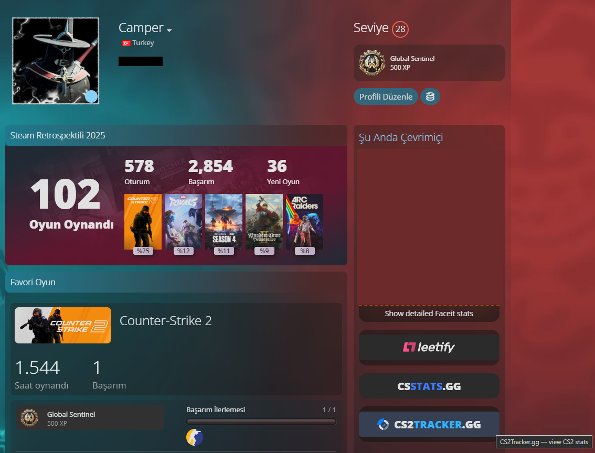
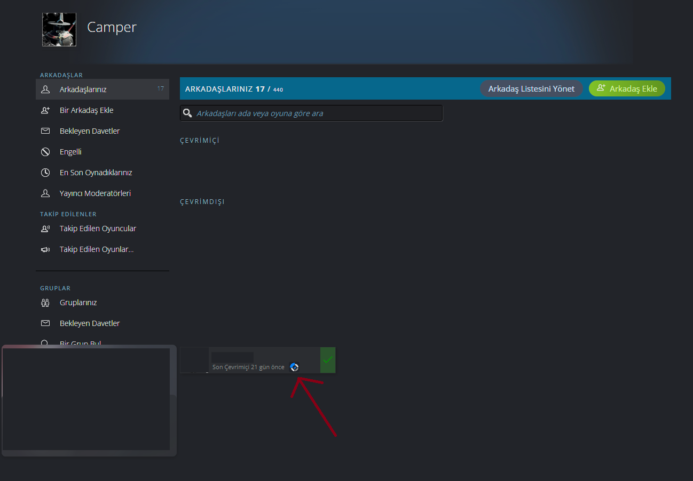
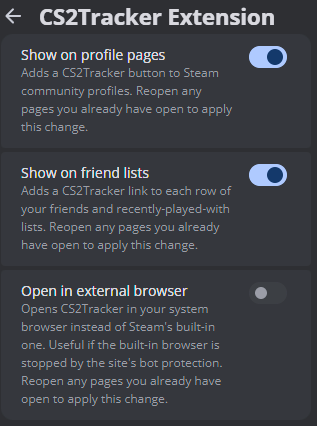

# CS2Tracker Extension

A [Millennium](https://steambrew.app/) plugin that puts [CS2Tracker](https://cs2tracker.gg) one click away from any Steam profile.

> Unofficial community plugin. Not affiliated with, endorsed by, or operated by CS2Tracker or Valve.



## Features

- **Profile button** — every Steam community profile gets a CS2Tracker button linking to that player's stats.
- **Friend list badges** — your friends list, pending list, and recently-played-with list each get a per-row badge.
- **Browser choice** — open CS2Tracker inside Steam or hand it to your system browser.



## Requirements

[Millennium](https://steambrew.app/) installed and running.

## Installation

### From the plugin store

1. Open Steam with Millennium installed.
2. Go to **Millennium → Plugins**.
3. Click **Install a plugin**.
4. Paste the plugin ID: `7bac0b377579`
5. Click **Install**, then restart Steam when prompted.

### From source

```bash
git clone https://github.com/MuhammedResulBilkil/cs2tracker-extension.git
cd cs2tracker-extension
pnpm install
pnpm run build
```

Then copy or symlink the folder into your Millennium plugins directory:

| OS | Path |
|---|---|
| Windows | `C:\Program Files (x86)\Steam\millennium\plugins\cs2tracker-extension` |
| Linux | `~/.local/share/millennium/plugins/cs2tracker-extension` |
| macOS | `~/Library/Application Support/millennium/plugins/cs2tracker-extension` |

Restart Steam and enable the plugin under **Millennium → Plugins**.

## Settings



| Setting | Default | What it does |
|---|---|---|
| Show on profile pages | On | Adds the CS2Tracker button to Steam community profiles |
| Show on friend lists | On | Adds a badge to each friend row |
| Open in external browser | Off | Opens CS2Tracker in your system browser instead of Steam's built-in one |

Profile pages you already have open keep their old settings. Reopen them to apply a change. The same
applies to switching the plugin off: pages that are already open keep the button and badges until you
close or reload them.

## How it works

The plugin runs in three places. A Lua backend stores your settings. A React panel inside Steam's own UI renders those settings using Steam's component library. A webkit bundle runs inside Steam's community browser and does the actual page injection, reading each profile's Steam ID from the page rather than from your own account.

## Privacy

Two separate questions, because they have different answers and both matter.

**What the plugin sends by itself.** Nothing, to anybody but Steam. There is no CS2Tracker Extension server, no analytics and no telemetry, and the plugin makes exactly one request of its own: the current page's `?xml=1` view on `steamcommunity.com`, while working out whose profile you are looking at.

Your settings are stored on your machine by Millennium. The buttons and badges are built locally, and putting one on a page sends nothing to CS2Tracker.

**Where the links go.** Every CS2Tracker link contains the SteamID64 of the player it is about, so opening one sends that ID to `cs2tracker.gg` — that is how the site knows whose stats to show, and it is the whole point of the plugin. Clicking the profile button or a friend-list badge therefore tells CS2Tracker which player you just looked up.

This happens only when you click. Nothing reaches CS2Tracker in the background, no page you leave alone reports anything to it, and CS2Tracker is never contacted until you open a link. CS2Tracker is a third party: what it does with a request it receives is governed by its policies, not by this plugin.

## Development

```bash
pnpm install
pnpm run dev        # one-off development build
pnpm run watch      # rebuild on change
pnpm run build      # production build
pnpm run typecheck  # type check the frontend and webkit bundles
pnpm test           # run the test suite
```

`pnpm run typecheck` is one of three typecheck commands, and it does not subsume the other two — the
frontend and webkit bundles are compiled as separate programs there, the root project is the only one
that reaches `tests/`, and `scripts/` is checked under Node's types alone. Before opening a pull
request, run the full set of gates listed in
[CONTRIBUTING.md](CONTRIBUTING.md#before-you-open-a-pull-request); the commands above are for working,
not for verifying.

See [docs/ARCHITECTURE.md](docs/ARCHITECTURE.md) for the design notes and [CONTRIBUTING.md](CONTRIBUTING.md) before opening a pull request.

## License

MIT — see [LICENSE.md](LICENSE.md).

## Links

- [Millennium](https://steambrew.app/)
- [Millennium plugin store](https://steambrew.app/plugins)
- [CS2Tracker](https://cs2tracker.gg)
